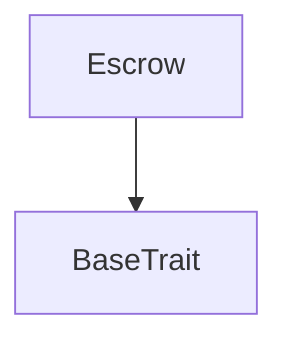

# Tact compilation report
Contract: Escrow
BoC Size: 2380 bytes

## Structures (Structs and Messages)
Total structures: 23

### DataSize
TL-B: `_ cells:int257 bits:int257 refs:int257 = DataSize`
Signature: `DataSize{cells:int257,bits:int257,refs:int257}`

### SignedBundle
TL-B: `_ signature:fixed_bytes64 signedData:remainder<slice> = SignedBundle`
Signature: `SignedBundle{signature:fixed_bytes64,signedData:remainder<slice>}`

### StateInit
TL-B: `_ code:^cell data:^cell = StateInit`
Signature: `StateInit{code:^cell,data:^cell}`

### Context
TL-B: `_ bounceable:bool sender:address value:int257 raw:^slice = Context`
Signature: `Context{bounceable:bool,sender:address,value:int257,raw:^slice}`

### SendParameters
TL-B: `_ mode:int257 body:Maybe ^cell code:Maybe ^cell data:Maybe ^cell value:int257 to:address bounce:bool = SendParameters`
Signature: `SendParameters{mode:int257,body:Maybe ^cell,code:Maybe ^cell,data:Maybe ^cell,value:int257,to:address,bounce:bool}`

### MessageParameters
TL-B: `_ mode:int257 body:Maybe ^cell value:int257 to:address bounce:bool = MessageParameters`
Signature: `MessageParameters{mode:int257,body:Maybe ^cell,value:int257,to:address,bounce:bool}`

### DeployParameters
TL-B: `_ mode:int257 body:Maybe ^cell value:int257 bounce:bool init:StateInit{code:^cell,data:^cell} = DeployParameters`
Signature: `DeployParameters{mode:int257,body:Maybe ^cell,value:int257,bounce:bool,init:StateInit{code:^cell,data:^cell}}`

### StdAddress
TL-B: `_ workchain:int8 address:uint256 = StdAddress`
Signature: `StdAddress{workchain:int8,address:uint256}`

### VarAddress
TL-B: `_ workchain:int32 address:^slice = VarAddress`
Signature: `VarAddress{workchain:int32,address:^slice}`

### BasechainAddress
TL-B: `_ hash:Maybe int257 = BasechainAddress`
Signature: `BasechainAddress{hash:Maybe int257}`

### Deploy
TL-B: `deploy#946a98b6 queryId:uint64 = Deploy`
Signature: `Deploy{queryId:uint64}`

### DeployOk
TL-B: `deploy_ok#aff90f57 queryId:uint64 = DeployOk`
Signature: `DeployOk{queryId:uint64}`

### FactoryDeploy
TL-B: `factory_deploy#6d0ff13b queryId:uint64 cashback:address = FactoryDeploy`
Signature: `FactoryDeploy{queryId:uint64,cashback:address}`

### Game
TL-B: `_ id:uint64 creator:address joiner:address jettonMaster:address amount:coins state:int257 createdAt:uint32 joinedAt:Maybe int257 winner:address claimed:bool = Game`
Signature: `Game{id:uint64,creator:address,joiner:address,jettonMaster:address,amount:coins,state:int257,createdAt:uint32,joinedAt:Maybe int257,winner:address,claimed:bool}`

### JettonPayload
TL-B: `_ action:uint8 gameId:uint64 = JettonPayload`
Signature: `JettonPayload{action:uint8,gameId:uint64}`

### CreateGameTon
TL-B: `create_game_ton#00000001 amount:coins joinTimeout:uint32 = CreateGameTon`
Signature: `CreateGameTon{amount:coins,joinTimeout:uint32}`

### JoinGameTon
TL-B: `join_game_ton#00000002 gameId:uint64 = JoinGameTon`
Signature: `JoinGameTon{gameId:uint64}`

### CancelGame
TL-B: `cancel_game#00000003 gameId:uint64 = CancelGame`
Signature: `CancelGame{gameId:uint64}`

### ReportWinner
TL-B: `report_winner#00000004 gameId:uint64 winner:address = ReportWinner`
Signature: `ReportWinner{gameId:uint64,winner:address}`

### WithdrawUnclaimed
TL-B: `withdraw_unclaimed#00000005  = WithdrawUnclaimed`
Signature: `WithdrawUnclaimed{}`

### OnJettonTransfer
TL-B: `on_jetton_transfer#00000010 sender:address amount:coins payload:JettonPayload{action:uint8,gameId:uint64} jettonMaster:address = OnJettonTransfer`
Signature: `OnJettonTransfer{sender:address,amount:coins,payload:JettonPayload{action:uint8,gameId:uint64},jettonMaster:address}`

### ClaimJetton
TL-B: `claim_jetton#00000011 gameId:uint64 = ClaimJetton`
Signature: `ClaimJetton{gameId:uint64}`

### Escrow$Data
TL-B: `_ nextGameId:uint64 admin:address feeWallet:address minTon:coins games:dict<uint64, ^Game{id:uint64,creator:address,joiner:address,jettonMaster:address,amount:coins,state:int257,createdAt:uint32,joinedAt:Maybe int257,winner:address,claimed:bool}> = Escrow`
Signature: `Escrow{nextGameId:uint64,admin:address,feeWallet:address,minTon:coins,games:dict<uint64, ^Game{id:uint64,creator:address,joiner:address,jettonMaster:address,amount:coins,state:int257,createdAt:uint32,joinedAt:Maybe int257,winner:address,claimed:bool}>}`

## Get methods
Total get methods: 0

## Exit codes
* 2: Stack underflow
* 3: Stack overflow
* 4: Integer overflow
* 5: Integer out of expected range
* 6: Invalid opcode
* 7: Type check error
* 8: Cell overflow
* 9: Cell underflow
* 10: Dictionary error
* 11: 'Unknown' error
* 12: Fatal error
* 13: Out of gas error
* 14: Virtualization error
* 32: Action list is invalid
* 33: Action list is too long
* 34: Action is invalid or not supported
* 35: Invalid source address in outbound message
* 36: Invalid destination address in outbound message
* 37: Not enough Toncoin
* 38: Not enough extra currencies
* 39: Outbound message does not fit into a cell after rewriting
* 40: Cannot process a message
* 41: Library reference is null
* 42: Library change action error
* 43: Exceeded maximum number of cells in the library or the maximum depth of the Merkle tree
* 50: Account state size exceeded limits
* 128: Null reference exception
* 129: Invalid serialization prefix
* 130: Invalid incoming message
* 131: Constraints error
* 132: Access denied
* 133: Contract stopped
* 134: Invalid argument
* 135: Code of a contract was not found
* 136: Invalid standard address
* 138: Not a basechain address
* 5486: join timeout not passed
* 5913: amount below minimum
* 6423: only winner can claim
* 10541: winner must be player
* 18980: only waiting games can be cancelled
* 19635: attach declared amount
* 21885: only admin
* 26028: only admin can report
* 26218: game not waiting
* 41490: attach exact stake
* 44463: already claimed
* 50049: game not finished
* 50479: game not found
* 52959: not a jetton game
* 53249: creator can't join own game
* 56165: game not in progress
* 61763: only creator can cancel

## Trait inheritance diagram

## Contract dependency diagram

